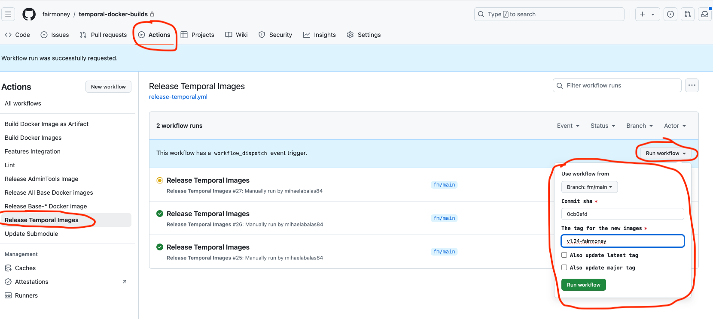

# Upgrade Temporal Helm chart

#### 1. Sync master branch

On `master` branch just push sync-fork

#### 2. Merge the master branch into fm-devops

Open pull request to merge the `master` branch into `fm-devops`. When resolving conflicts, take into account the following changes that were done to `fm-devops` and that shouldn't be lost:

- [https://github.com/fairmoney/temporal-helm-charts/pull/10/files](https://github.com/fairmoney/temporal-helm-charts/pull/10/files)
- [https://github.com/fairmoney/temporal-helm-charts/pull/4/files](https://github.com/fairmoney/temporal-helm-charts/pull/4/files)
- [https://github.com/fairmoney/temporal-helm-charts/pull/18](https://github.com/fairmoney/temporal-helm-charts/pull/18)

Also, on `fm-devops` branch, there are some additional files specific for Fairmoney deployments:

- charts/temporal/templates/certificates.yaml
- charts/temporal/templates/external-secrets.yaml
- charts/temporal/README.md

After resolving the conflicts, when prompted, choose to write the changes to a new branch (e.g. `master-upgrade`). Then, a new PR from `master-upgrade` into `fm-devops` will be created.

### 3. Mirror the new `admin-tools` and `ui` images to service ECR

Mirror the tags used by the new temporal-helm-chart version.

### 4. Build new Temporal server image

Follow [these](#upgrade-temporal-server-image) steps to upgrade the temporal server image to the release used by the new temporal-helm-chart version.

## ECR Repositories inventory:

Upstream images are mirrored to:
```
409558311582.dkr.ecr.eu-west-1.amazonaws.com/temporalio-admin-tools
409558311582.dkr.ecr.eu-west-1.amazonaws.com/temporalio-server
409558311582.dkr.ecr.eu-west-1.amazonaws.com/temporalio-ui
```

Fairmoney custom built images are pushed to:
```
409558311582.dkr.ecr.eu-west-1.amazonaws.com/temporalio-server/server
409558311582.dkr.ecr.eu-west-1.amazonaws.com/temporalio-server/admin-tools
409558311582.dkr.ecr.eu-west-1.amazonaws.com/temporalio-server/auto-setup
```
In the Hosted Temporal deployment we currently we use upstream images, except for the server image where we use the Fairmoney one (`409558311582.dkr.ecr.eu-west-1.amazonaws.com/temporalio-server/server`).

# Upgrade Temporal server image

Fairmoney temporal server image build process relies on the following repositories:

- [fairmoney/temporal](https://github.com/fairmoney/temporal)
- [fairmoney/temporal-docker-build](https://github.com/fairmoney/temporal-docker-builds)
- [fairmoney/temporal-features](https://github.com/fairmoney/temporal-features)

These repositories have custom workflow changes to fit in the Fairmoney CI pipeline. `fairmoney/temporal` also has the fm-authorizer and fm-claim-mapper custom modules. These changes are in `fm/*` branches.

`fairmoney/temporal` is where the temporal server code reside and the final image is built based on the `fm/main` branch. 

Here is how the upgrade process to newer temporal release from upstream would look like: 

#### Lets take the example of merging upstream release/v1.25.x into fm/main

```
git clone https://github.com/fairmoney/temporal.git # Clone the Fairmoney organization repository
cd temporal
git remote add upstream https://github.com/temporalio/temporal.git # Add the upstream repository as a remote
git fetch upstream release/v1.25.x #  Fetch the specific branch from the upstream repo
git checkout -b release/v1.25.x upstream/release/v1.25.x # Checkout to the fetched branch (optional)
git cherry-pick a027abccc2dafcdf97e0a0b86fba577194e791ef # Cherry pick the commit that contains the fm claim-mapper and authorizer
git push origin release/v1.25.x:fm/release/v1.25.x # Push the branch to the organization repository

git checkout -b fm/ci-workflows # Checkout to a new branch that will include the CI changes
# Depending on the upstream evolution either cherry pick commit c1f0636d48bff9408262028cc4abf3ce40defddc and commit f3664539c6494813b30127f412a6226b5f593454 or manually change all the needed places to make CI working (see https://github.com/fairmoney/temporal/pull/7/files)
git push origin fm/ci-workflows
# On the Fairmoney organization repository create pull request from fm/ci-workflows into fm/release/v1.25.x (see https://github.com/fairmoney/temporal/pull/6)
# Once there are no CI errors (not neccesarily failed tests, there may be some units failed units tests), merge the pull request opened to fm/release/v1.25.x
# Now back on your local branch
git pull --rebase origin fm/release/v1.25.x # Pull changes merged in the organization repository
git push origin release/v1.25.x:fm/main --force # Ovewrite fm/main branch
```

When pull request is merged to `fm/main`, in the `fairmoney/temporal` repository,  the following workflows are triggered: `github/workflows/run-tests.yml`, `.github/workflows/features-integration.yml`  **AND** `.github/workflows/trigger-publish.yml`. `.github/workflows/trigger-publish.yml` will invoke `update-submodules` (from `fairmoney/temporal-docker-builds`) to update all submodules to their latest commit.

In `fairmoney/temporal-docker-builds`, `.github/workflows/update-submodules.yml` workflow  will push a commit to `fm/main` branch. As a result of the push, the following workflow will be triggered: `.github/workflows/docker.yml`

`github/workflows/docker.yml` builds Docker images and publishes to service account's ECR in the following repos: 
- temporalio-server/admin-tools
- temporalio-server/auto-setup
- temporalio-server/server


After the images are published, pick up the `sha` from service account's ECR repository `temporalio-server/server` of the latest image pushed (just the 7 characters, without the sha prefix).
Now, to release a new FM temporal server image, from `fairmoney/temporal-docker-builds` manually trigger the following workflow: **Release Temporal Images** (`.github/workflows/release-temporal.yml`) as shown in the image:
- make sure the branch selected is `fm/main`
- commit sha picked from ECR
- set the tag for the image, make sure it starts with **v** (e.g. v1.25-fairmoney)


